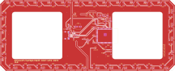
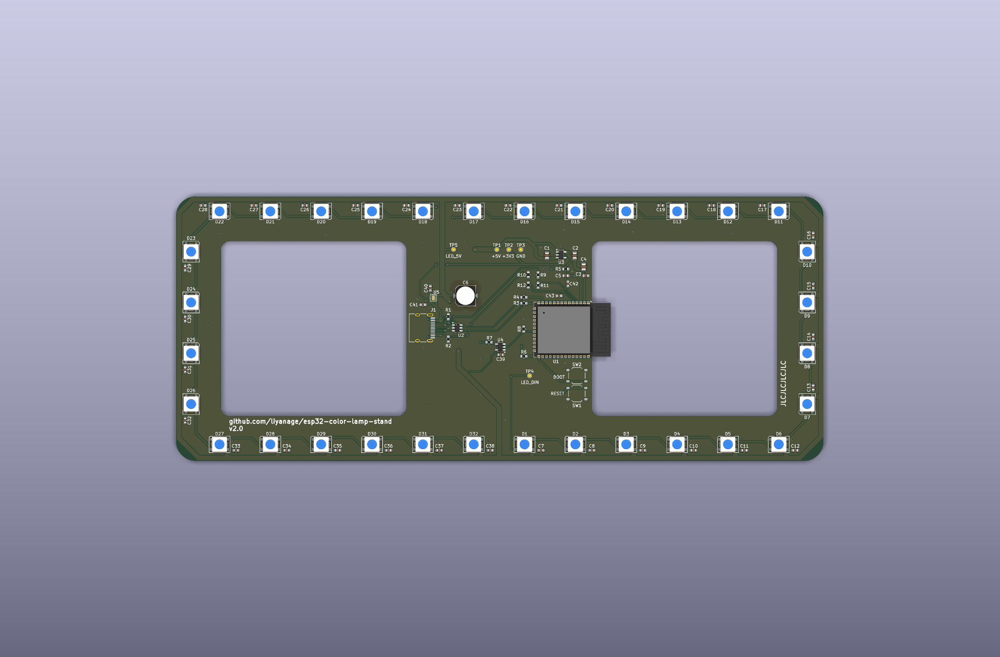

# Modifying the Color Lamp Stand

This document is for people who want to change the firmware or hardware. The
main [README](README.md) is the regular user guide.

## Software

The firmware is a small ESP-IDF 6 application for the
ESP32-S3-WROOM-1-N8R8. At a high level:

- `main/main.c` starts the hardware, configures Espressif's RMT/DMA-backed
  LED-strip driver, displays the USB power indication, reacts to Wi-Fi state
  changes, retrieves the stock value, and drives the LED effect.
- `main/wifi_manager.c` owns saved credentials, normal Wi-Fi connection, the
  temporary setup access point, captive web portal, and BOOT-button reset.
- `main/provisioning.html` is the setup page embedded in the firmware image.
- `main/usb_source.c` reads the USB-C CC voltage dividers and selects a safe LED
  brightness limit.
- `main/pixel.c` contains the color representation and interpolation helpers.

Activate ESP-IDF 6.0.2, then build and flash over the ESP32-S3's native USB
connection. The ESP-IDF component manager downloads the locked version of
Espressif's `led_strip` driver automatically:

```sh
. "$HOME/esp/esp-idf-v6.0.2/export.sh"
idf.py build
idf.py flash monitor
```

`main/idf_component.yml` declares the dependency and `dependencies.lock` pins
the resolved `led_strip` version to 3.0.3 for reproducible builds.

The hardware fixes only a few firmware-facing GPIO choices:

| Function | ESP32-S3 connection | Notes |
| --- | --- | --- |
| LED data | GPIO13 | Feeds the 74AHCT1G125 level shifter and then the first LED. |
| USB-C CC1 sense | GPIO4 / ADC1 channel 3 | Reads the divided CC1 voltage. |
| USB-C CC2 sense | GPIO5 / ADC1 channel 4 | Reads the divided CC2 voltage. |
| USB D− | GPIO19 | Native ESP32-S3 USB. |
| USB D+ | GPIO20 | Native ESP32-S3 USB. |
| BOOT button | GPIO0 | Held for five seconds after startup to erase saved Wi-Fi details. |

The current application happens to be a Wi-Fi-connected stock indicator, but
nothing requires you to preserve it. Feel free to ignore or delete the existing
firmware and turn the board into a completely new, custom 32-pixel ESP32-S3
project—the table above is the essential hardware contract.

## Hardware

The authoritative design is the KiCad project in `pcb/`. The images below are
published for convenient inspection; use the KiCad files when making changes.

[](docs/technical-resources/esp32-color-lamp-stand.svg)

*Complete schematic — select the image to open the full-resolution vector view.*

[](docs/technical-resources/pcb-layout-top.svg)

*Top copper, solder mask, silkscreen, holes, and board outline.*

[](pcb/manufacturing/jlcpcb/board-top.png)

*3D top-side assembly render.*

The main hardware blocks are:

- **ESP32-S3-WROOM-1-N8R8:** Wi-Fi controller with native USB.
- **32 addressable RGB LEDs:** A perimeter chain, each with a local 100 nF bypass
  capacitor.
- **AP2112K-3.3 regulator:** Converts USB 5 V to the ESP32's 3.3 V supply.
- **TPS22975 load switch:** Soft-starts and sequences the LED 5 V rail. Its
  enable input comes from the 3.3 V rail, so the ESP32-side supply starts before
  the LEDs; C40 then sets a controlled output-voltage ramp. This prevents the
  220 µF bulk capacitor, the LEDs' local bypass capacitors, and the LED
  electronics from all charging abruptly when USB-C power is connected,
  reducing inrush current and the resulting dip on the USB 5 V rail. Its low
  on-resistance carries the normal LED current efficiently, and it includes
  thermal shutdown, but it does not regulate the voltage or provide current
  limiting. The 220 µF capacitor supplies short LED load transients after
  startup.
- **74AHCT1G125 buffer:** Converts the ESP32's 3.3 V LED data signal to a robust
  5 V logic level.
- **USBLC6-2SC6 protection:** Protects the native USB data pair against static
  discharge.
- **USB-C CC resistors and ADC dividers:** Present the board as a USB-C sink and
  let firmware distinguish default, 1.5 A, and 3 A source advertisements.
- **RESET and BOOT buttons plus test pads:** Support recovery, programming, and
  diagnosis. Test pads are intentionally excluded from assembly.

The PCB has two copper layers with ground zones on both sides.

KiCad 10 and Python 3 are used for the hardware workflow:

```sh
make -C pcb check
make -C pcb manufacturing
```

The first command runs ERC, DRC, connectivity, and schematic/PCB parity checks.
The second also regenerates the JLCPCB Gerber ZIP, BOM, placement file, and board
renders in `pcb/manufacturing/jlcpcb/`. Component LCSC numbers live in the
schematic so assembly exports remain reproducible.
