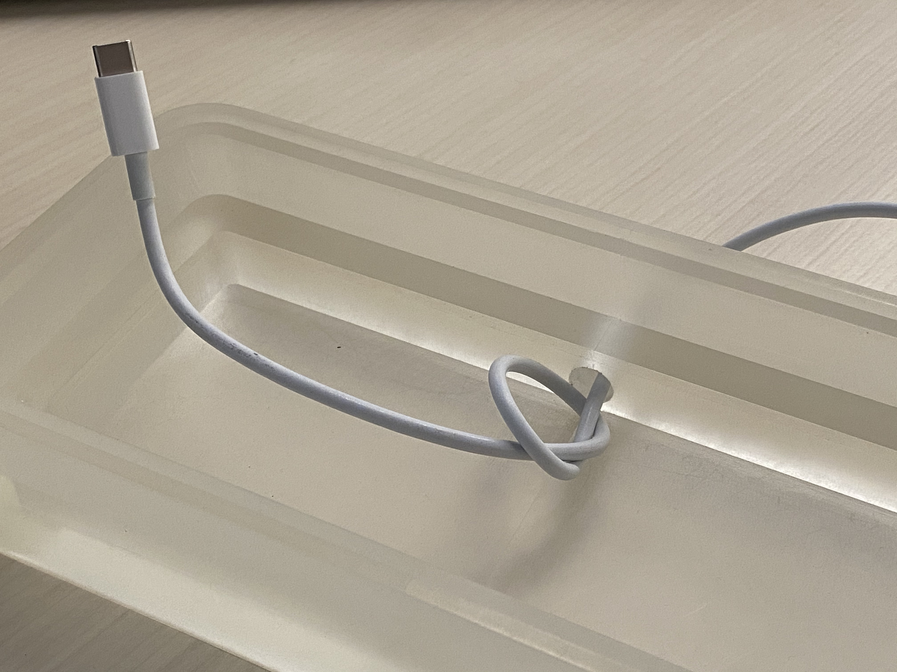
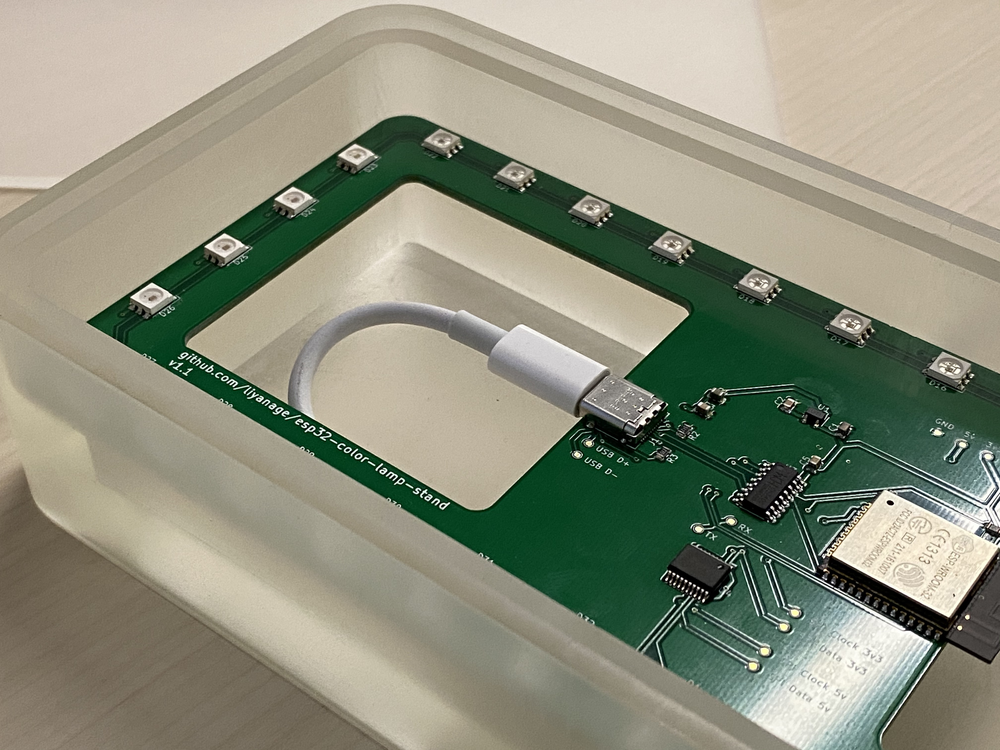

# User Guide

## Hardware Installation

1.) You'll need a USB-C power source, either your Mac or a USB-C wall charger
that can provide at least 1.5A. I've had good results with this one from Anker:
https://www.amazon.com/dp/B07GWN4PGL.

2.) You'll also need a USB-C cable, intially for configuration of the WiFi
information, after that just for power. You should tie a knot into the cable
on the inside of the base for strain relief as shown in the following photo.

3.) Connect the USB-C connector to the plug on the board as shown
in the following photo.

Put the translucent cover on top and put your object
to be illuminated on top of the cover.

## WiFi Configuration

Follow these steps to configure the WiFi network information.

1.) Plug the other end of the USB-C cable into your Mac.

2.) Find out the serial device path with

    ls -l /dev/cu.usbserial*
    
That gives you something like "/dev/cu.usbserial-1410"

3.) Run the following "screen" command to connect to the lamp's serial console:

    screen /dev/cu.usbserial-1410 115200

4.) Immediately after typing that command the microcontroller will reboot when the
serial connection opens. Immediately press any key a few times to enter the
configuration menu. If you missed it, disconnect the screen session as shown in
step 7 and try again.

5.) Once you're in the configuration menu, choose "w" to set the Wifi settings.
Enter your WiFi name and password when prompted.

6.) Choose "r" from the main menu to reboot. Check the log messages after the
reboot to ensure the device can connect to WiFi successfully.

7.) Disconnect the screen session with Ctrl-a followed by Ctrl-\ .

# How it's Made

## Enclosure

CAD model: https://a360.co/36blYHf

... more to come

## PCB

... more to come

## Software

... more to come