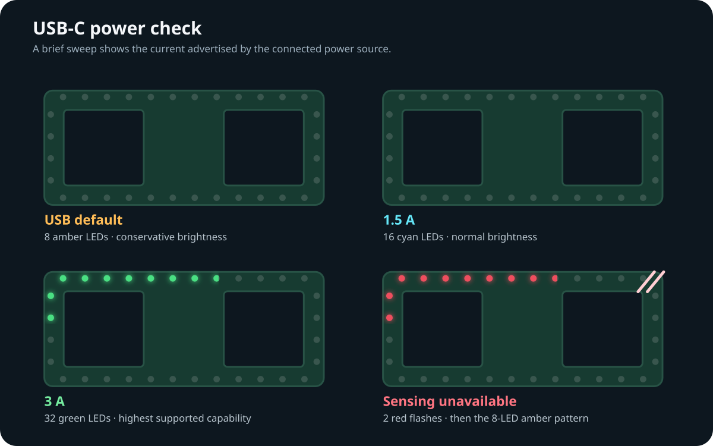
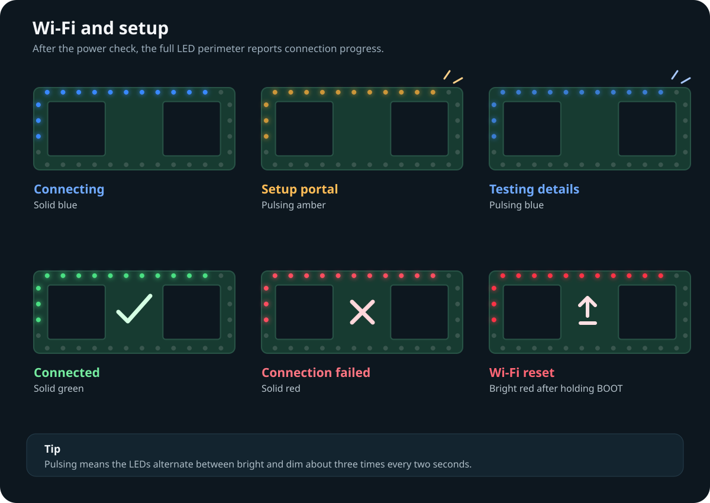

# Color Lamp Stand — User Guide

This illuminated stand connects to Wi-Fi and uses its 32 LEDs to show whether
a stock selected in the firmware is up or down: green for up, red for down, and
white when no current value is available. The stock cannot currently be changed
through the Wi-Fi setup page.

This is the default behavior, but you could modify the software to do something
completely different or custom with the LEDs and the Internet connection.

## Hardware

You need:

- A USB-C power source that can provide at least 1.5 A. A USB-C wall charger is
  ideal; a computer USB-C port also works.
- A USB-C cable for power.

Feed the cable through the base and tie a loose knot inside for strain relief,
as shown below. Do not pull the knot tight enough to damage the cable.

Connect the USB-C plug to the socket on the circuit board.

Fit the translucent cover, then place the object you want to illuminate on top.

## Wi-Fi configuration

On first use, the stand pulses amber and creates a temporary Wi-Fi network named
`ColorLamp-Setup-XXXX`, where the last four characters are unique to your stand.

1. On a phone, tablet, or computer, open Wi-Fi settings and join that network.
   It intentionally has no password and may be described by your device as
   having no internet.
2. The setup page should open automatically. If it does not, open
   [http://192.168.4.1](http://192.168.4.1) in a web browser.
3. Select your home Wi-Fi network, enter its password, and choose **Connect**.
4. The stand pulses blue while it tests the connection. Green means setup
   succeeded and the stand will restart. Red means it could not connect; check
   the network and password, then try again.

Your Wi-Fi password is stored only on the stand.

### Changing the Wi-Fi network

With the stand fully started, hold the **BOOT** button on the circuit board for
five seconds. The LEDs turn red, the saved Wi-Fi details are erased, and the
stand restarts in setup mode.

Do not hold **BOOT** while plugging in power or pressing **RESET**. That button
also activates the ESP32's programming mode during startup.

## What the lights during startup mean

### Power check

Immediately after power-on, a short sweep reports how much current the connected
USB-C source advertises. The stand uses this information to limit LED brightness.
The sweep fills, pauses for about a second, and fades away.

- **8 amber LEDs — USB default:** The stand uses a conservative, low-brightness
  limit. For better illumination, try a USB-C charger rated for at least 1.5 A.
- **16 cyan LEDs — 1.5 A:** Normal operation with good available brightness.
- **32 green LEDs — 3 A:** The source advertises the highest supported current.
- **Two red flashes, then 8 amber LEDs:** The stand could not read the source
  capability and safely selected the conservative limit.

This is the capability advertised by the power source, not a measurement of how
much current the stand is presently consuming.

### Wi-Fi and setup

After the power check, the entire perimeter shows the Wi-Fi state.

- **Solid blue:** Connecting to the saved Wi-Fi network.
- **Pulsing amber:** Waiting for you to join `ColorLamp-Setup-XXXX` and complete
  setup.
- **Pulsing blue:** Testing the Wi-Fi name and password you entered.
- **Solid green:** Connected successfully. After initial setup, the stand soon
  restarts automatically.
- **Solid red:** The attempted Wi-Fi connection failed.
- **Bright red after holding BOOT:** Saved Wi-Fi details are being erased.

## Troubleshooting

- **The setup page did not open:** Stay connected to `ColorLamp-Setup-XXXX` and
  open [http://192.168.4.1](http://192.168.4.1) manually. Temporarily disabling
  cellular data or a VPN can help if the phone leaves the setup network.
- **The stand keeps returning to amber setup mode:** Re-enter the Wi-Fi password
  and make sure the selected network is available where the stand will be used.
- **The light is unusually dim:** Check the power-on sweep. Eight amber LEDs mean
  the power source advertised only the default USB current; try another USB-C
  charger and cable.
- **You need to start over:** Let the stand finish booting, then hold **BOOT** for
  five seconds.

## Want to modify it?

The hardware and especially firmware are open for experimentation. See the
[modification guide](MODIFYING.md) for the source layout, fixed GPIO assignments,
KiCad design overview, and build workflow.
